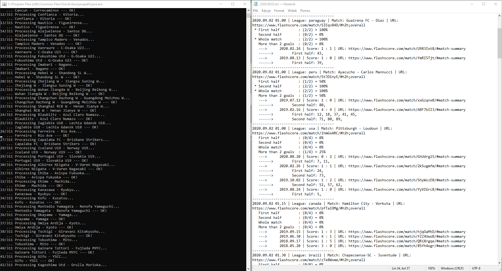

# Bet Match Analyzer

"BetMatchAnalyzer" analyzes everyday soccer matches and if the conditions given by the user are fulfilled, application saves match details as a text file.

Conditions:
* if in last 5 years there was minimum 80% matches in wchich there was goal after 35 minute in the first half
* if in last 5 years there was minimum 80% matches in wchich there was goal after 74 minute in the second half
* if any of the above
* if in last 5 years there was minimum 80% matches in wchich there was minimum 3 goals in the first or the second half

